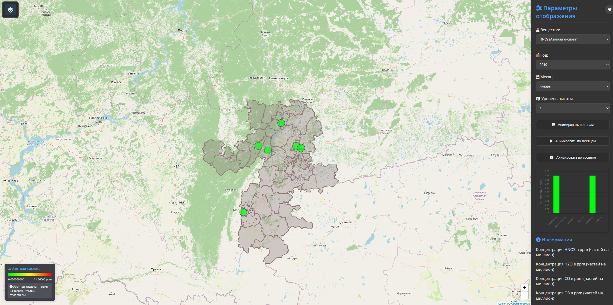

# Веб-ГИС мониторинга качества атмосферного воздуха по спутниковым данным

Интерактивная карта концентраций HNO₃, CO, H₂O и O₃ над Челябинской областью
по данным спутникового мониторинга и химического реанализа NASA.

Проект выполнен как выпускная квалификационная работа (бакалавриат, УУНиТ):

> **Статус:** версия ВКР (`v1.0-thesis`), зафиксирована как есть.
> Развитие проекта — см. [План развития](#план-развития).



## Возможности

- карта с маркерами городов (Челябинск, Магнитогорск, Златоуст, Миасс, Копейск, Озёрск) и границей области;
- выбор вещества, года, месяца и уровня высоты (уровни давления от поверхности до верхней тропосферы);
- анимация по годам, месяцам и уровням;
- график концентрации по выбранному городу (Chart.js);
- светлая и тёмная тема, переключение картографических подложек.

## Стек

HTML, CSS, JavaScript, [Leaflet](https://leafletjs.com/), [Chart.js](https://www.chartjs.org/).
Обработка данных — Python (netCDF4, NumPy, pandas).

## Запуск

Браузер не загружает JSON-файлы со страницы, открытой напрямую (`file://`),
поэтому нужен любой локальный веб-сервер.

```bash
git clone https://github.com/mellaque/chelyabinsk-air-gis.git
cd chelyabinsk-air-gis
python -m http.server 8000
```

Затем открыть <http://localhost:8000>.

Альтернатива — расширение **Live Server** в VS Code: ПКМ по `index.html` → «Open with Live Server».

## Структура

```
├── index.html              # страница приложения
├── css/map-controls.css    # стили
├── js/app.js               # логика карты, графиков и анимаций
├── data/
│   ├── hno3_data.json      # HNO₃ по 6 городам, 27 уровней
│   ├── co_data.json        # CO
│   ├── h2o_data.json       # H₂O
│   ├── o3_data.json        # O₃
│   └── region.geojson      # граница Челябинской области
└── scripts/legacy/         # исходный скрипт обработки из ВКР
```

## Данные

| Вещество | Источник |
|---|---|
| HNO₃ | TROPESS Chemical Reanalysis (TCR-2), продукт `TRPSCRHNO3M3D`, NASA JPL — [doi:10.5067/0VC7M1P01TQ7](https://doi.org/10.5067/0VC7M1P01TQ7) |
| CO, H₂O, O₃ | Aura MLS (Microwave Limb Sounder), NASA |

Исходные файлы NetCDF не хранятся в репозитории (около 45 МБ на файл).
Данные NASA распространяются свободно, для скачивания нужна бесплатная учётная запись
[NASA Earthdata](https://urs.earthdata.nasa.gov/).

Картографическая основа и границы административных единиц (`region.geojson`) — © участники
[OpenStreetMap](https://www.openstreetmap.org/copyright), лицензия [ODbL](https://opendatacommons.org/licenses/odbl/).
Границы взяты из выгрузки OSM в shape-файлах проекта [ГИС-Лаб](http://gis-lab.info/projects/osmshp/)
и конвертированы в GeoJSON в QGIS.

## Известные проблемы версии ВКР

При повторном разборе проекта в данных версии ВКР обнаружены ошибки.
Они сохранены в этой версии как есть и исправляются в новом пайплайне.

- **Сдвиг года на 1.** Год вычислялся по порядковому номеру файла, а не из метаданных:
  данные, подписанные как 2010 г., на самом деле относятся к 2011 г. и т. д.
- **Дубликат файла за 2021 г.** Вместо данных за 2022 г. был обработан повторно файл за 2021 г.
- **Пропуски отображаются как нули.** Отсутствующие значения (например, уровни давления ниже поверхности
  земли) записаны как `0`, что на карте выглядит как низкая концентрация.
- **Единицы измерения.** HNO₃ хранится в ppb, CO/H₂O/O₃ — в объёмных долях (mol/mol),
  но интерфейс подписывает все значения как ppm; шкала легенды не соответствует диапазону данных.
- **CO и H₂O.** На промежуточном этапе данные по разным регионам оказались скопированы
  друг с друга, поэтому их принадлежность Челябинской области не гарантируется.
- **Пространственное разрешение.** Ячейка сетки TCR-2 — около 125 × 70 км, поэтому соседние города
  (Челябинск и Копейск, Миасс и Златоуст) получают одинаковые значения.

## План развития

- [ ] Новый пайплайн NetCDF → JSON без промежуточного Excel: год из метаданных, `null` для пропусков, явные единицы
- [ ] Отображение пропусков на карте и корректные подписи единиц
- [ ] Скрипт автоматической загрузки данных с NASA Earthdata
- [ ] Повторная загрузка и обработка CO, H₂O, O₃ из Aura MLS
- [ ] Docker и docker-compose
- [ ] CI/CD на GitHub Actions: проверки, сборка, деплой
- [ ] Регион и список городов в конфигурационном файле

## Лицензия

Код — [MIT](LICENSE). Данные — по условиям их правообладателей (NASA, участники OpenStreetMap).
