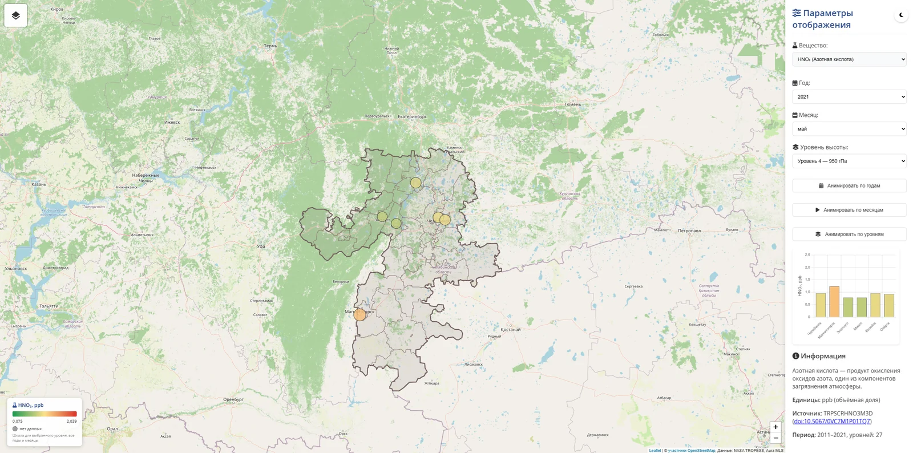

# Веб-ГИС мониторинга качества атмосферного воздуха по спутниковым данным

[](https://github.com/mellaque/chelyabinsk-air-gis/actions/workflows/ci.yml)
[](https://github.com/mellaque/chelyabinsk-air-gis/actions/workflows/security.yml)

Интерактивная карта концентраций загрязнителей воздуха (NO₂, SO₂, CO, O₃, формальдегида, HNO₃)
и водяного пара над Челябинской областью по данным химического реанализа NASA за 2005–2021 годы.

**Демо:** <https://mellaque.github.io/chelyabinsk-air-gis/>

Проект выполнен как выпускная квалификационная работа (бакалавриат, УУНиТ).

> **Статус:** проект развивается после защиты. Версия в том виде, в каком она защищалась, —
> тег [`v1.0-thesis`](https://github.com/mellaque/chelyabinsk-air-gis/tree/v1.0-thesis).
> Что изменилось — см. [Исправлено после ВКР](#исправлено-после-вкр).



## Возможности

- карта с маркерами городов (Челябинск, Магнитогорск, Златоуст, Миасс, Копейск, Озёрск) и границей области;
- выбор вещества, года, месяца и уровня высоты (уровни давления в гПа);
- анимация по годам, месяцам и уровням;
- график концентраций по городам (Chart.js);
- пропуски в данных показываются серым, а не как нулевая концентрация;
- семь веществ: NO₂, SO₂, CO, O₃, формальдегид, HNO₃ и водяной пар;
- подсказки с названиями районов; во всплывающем окне видно, какие города попали в одну ячейку сетки;
- светлая и тёмная тема, переключение картографических подложек.

## Стек

HTML, CSS, JavaScript, [Leaflet](https://leafletjs.com/), [Chart.js](https://www.chartjs.org/).
Обработка данных — Python (netCDF4, NumPy). Тесты — pytest, линтер — Ruff, CI — GitHub Actions.
Развёртывание — Docker, nginx (непривилегированный образ), Docker Compose.

## Запуск

### Готовый образ

Образ публикуется в GitHub Container Registry при каждом изменении `main`:

```bash
docker run --rm -p 8080:8080 ghcr.io/mellaque/chelyabinsk-air-gis:latest
```

Сайт откроется на <http://localhost:8080>. Конкретную версию можно взять по тегу: `:2.0.0`, `:sha-<коммит>`.

### Сборка из исходников в Docker

Нужен [Docker Desktop](https://www.docker.com/products/docker-desktop/) (Windows, macOS) или Docker Engine (Linux).

```bash
git clone https://github.com/mellaque/chelyabinsk-air-gis.git
cd chelyabinsk-air-gis
docker compose up -d --build
```

Сайт откроется на <http://localhost:8080>. Остановить: `docker compose down`.

Контейнер работает с минимальными правами: nginx запущен не от root, файловая система только
для чтения, без Linux capabilities. Данные отдаются со сжатием gzip, а браузер при каждом
открытии сверяет их с сервером (ответ 304, если файл не менялся).

### Без Docker

Браузер не загружает JSON-файлы со страницы, открытой напрямую (`file://`),
поэтому нужен любой локальный веб-сервер.

```bash
git clone https://github.com/mellaque/chelyabinsk-air-gis.git
cd chelyabinsk-air-gis
python -m http.server 8000
```

Затем открыть <http://localhost:8000>.

Альтернатива — расширение **Live Server** в VS Code: ПКМ по `index.html` → «Open with Live Server».

## Обновление данных

Готовые JSON уже лежат в `data/`, поэтому для запуска карты этот шаг не нужен.

Все вещества берутся из реанализа NASA TROPESS (TCR-2), список продуктов —
в [`config/substances.json`](config/substances.json). Одна команда скачивает исходные NetCDF
с NASA GES DISC, пересобирает `data/*.json` и проверяет их формат.

### 1. Учётная запись NASA Earthdata (один раз)

1. Зарегистрируйтесь на <https://urs.earthdata.nasa.gov/> (бесплатно).
2. **Applications → Authorized Apps → Approve More Applications** → найдите
   **NASA GESDISC DATA ARCHIVE** → **Approve**. Без этого сервер GES DISC отклоняет загрузку.
3. **Generate Token** → скопируйте токен. Токен действует ограниченное время; когда истечёт, создайте новый.

### 2. Загрузка и обработка

В Docker (Python ставить не нужно):

```bash
export EARTHDATA_TOKEN=<токен>        # или строка EARTHDATA_TOKEN=<токен> в файле .env (он в .gitignore)
docker compose run --rm update         # все вещества, ~2,7 ГБ исходных файлов
docker compose run --rm update co o3   # только указанные
```

Без Docker:

```bash
python -m venv .venv
source .venv/bin/activate              # Windows: .venv\Scripts\activate
pip install -r requirements-dev.txt
export EARTHDATA_TOKEN=<токен>
bash scripts/update_data.sh
```

Отдельные шаги:

```bash
python scripts/download_tcr2.py --substance co --dry-run         # какие файлы будут скачаны (токен не нужен)
python scripts/download_tcr2.py --substance co --years 2015-2021 # скачать в data/raw/co/
python scripts/process_tcr2.py --input data/raw/co --substance co --output data/co_data.json
python scripts/validate_data.py
```

**Загрузчик** ищет файлы в каталоге NASA CMR, скачивает их с токеном Earthdata (токен не передаётся
в облачное хранилище, куда перенаправляет сервер), пропускает уже скачанные файлы, докачивает
прерванные, повторяет запросы при перегрузке сервера и проверяет, что получен именно NetCDF.

**Обработчик** определяет год и месяц по данным внутри файла, пропускает повторно скачанные файлы,
останавливается, если для одного года найдены два разных файла, и переводит единицы
(объёмные доли — в ppb, удельную влажность — в г/кг). Города задаются в
[`config/cities.json`](config/cities.json), формат результата описан в
[`docs/data-format.md`](docs/data-format.md).

Обработка одного вещества из уже скачанных файлов: `docker compose run --rm pipeline`.

### Как добавить вещество

1. Продукт NASA — в [`config/substances.json`](config/substances.json) (ключ, `product`, `units`).
2. Название, описание и цвета — в `config.substances` в [`js/app.js`](js/app.js), ключ тот же.
3. `bash scripts/update_data.sh <ключ>` — скачать и обработать.

Тесты проверяют, что списки веществ в конфиге, на странице и в `data/` совпадают, —
наполовину добавленное вещество не пройдёт CI.

## Разработка, CI и CD

Весь конвейер описан в [`.github/workflows/ci.yml`](.github/workflows/ci.yml).
При каждом pull request и push в `main` запускаются проверки:

| Проверка | Что делает |
|---|---|
| **Ruff** | стиль кода и типичные ошибки в Python |
| **pytest** (Python 3.12 и 3.14) | тесты обработки NetCDF → JSON и проверки данных на синтетических файлах; тесты загрузчика на локальном «фальшивом NASA» (каталог, авторизация, редирект без утечки токена, докачка, повторы) |
| **Проверка данных** | `scripts/validate_data.py`: все `data/*.json` в актуальном формате, размерности совпадают, нет NaN и отрицательных значений, у проверенных данных указан источник, в `region.geojson` нет битой кодировки |
| **Фронтенд** | синтаксис `js/app.js`, подключённые в `index.html` файлы существуют |
| **Docker** | hadolint проверяет Dockerfile, оба образа собираются, контейнер стартует с ограниченными правами и становится healthy, smoke-тест (`scripts/smoke_test.sh`) проверяет страницы, данные, сжатие и заголовки |

Если все проверки прошли и изменения попали в `main`, выполняется публикация:

| Что | Куда |
|---|---|
| Сайт | GitHub Pages — <https://mellaque.github.io/chelyabinsk-air-gis/>, после деплоя проверяется, что страница и данные доступны |
| Образ сайта | `ghcr.io/mellaque/chelyabinsk-air-gis` — теги `latest` и `sha-<коммит>` |
| Образ пайплайна | `ghcr.io/mellaque/chelyabinsk-air-gis-pipeline` |

Тег вида `v2.0.0` публикует образы с номером версии (`:2.0.0`, `:2.0`).
В `main` код попадает только через pull request с зелёными проверками (ruleset ветки).

Проверки локально:

```bash
pip install -r requirements-dev.txt
ruff check .
pytest
python scripts/validate_data.py
```

Обновления зависимостей и версий actions раз в месяц предлагает Dependabot.

## Безопасность

- **Trivy** проверяет зависимости, оба Docker-образа, секреты и конфигурацию; **CodeQL** — код на Python
  и JavaScript и сами workflow. Отчёты — во вкладке Security, при каждом PR и раз в неделю
  ([`security.yml`](.github/workflows/security.yml)).
- Образ с критической уязвимостью, для которой уже есть исправление, не проходит CI.
- Все GitHub Actions закреплены по хешу коммита, у каждого job — минимальные права;
  workflow проверяются линтерами actionlint и [zizmor](https://docs.zizmor.sh/).
- Опубликованные образы подписаны **cosign** (Sigstore, без ключей), к ним приложены **SBOM**
  (список пакетов) и **provenance** (из какого коммита и каким workflow собран образ).

Проверка подписи и политика сообщения об уязвимостях — в [SECURITY.md](SECURITY.md).

## Структура

```
├── index.html                  # страница приложения
├── Dockerfile                  # образ сайта: проверка данных → nginx
├── Dockerfile.pipeline         # образ пайплайна обработки NetCDF
├── compose.yaml                # запуск: docker compose up
├── deploy/nginx.conf           # конфигурация nginx
├── css/map-controls.css        # стили
├── js/app.js                   # карта, график, анимации
├── config/
│   ├── cities.json             # города и их координаты
│   └── substances.json         # вещества → продукты NASA TCR-2 и единицы
├── data/
│   ├── hno3_data.json          # HNO₃: 6 городов, 2011–2021, 27 уровней
│   ├── co_data.json            # CO, H₂O, O₃ — данные версии ВКР (не проверены)
│   ├── h2o_data.json
│   ├── o3_data.json
│   ├── region.geojson          # граница области и районов
│   └── raw/                    # исходные NetCDF (не хранятся в git)
├── scripts/
│   ├── download_tcr2.py        # загрузка NetCDF с NASA GES DISC
│   ├── process_tcr2.py         # NetCDF (TCR-2) → JSON
│   ├── update_data.sh          # загрузка + обработка + проверка всех веществ
│   ├── validate_data.py        # проверка формата данных (CI и сборка образа)
│   ├── smoke_test.sh           # проверка запущенного сайта
│   ├── prepare_region.py       # подготовка границ из выгрузки OSM
│   └── legacy/                 # скрипты версии ВКР
├── tests/                      # pytest
├── docs/data-format.md         # описание формата данных
├── .github/
│   ├── workflows/ci.yml        # CI/CD: проверки, публикация образов и сайта
│   ├── workflows/security.yml  # Trivy и CodeQL, в том числе еженедельно
│   └── dependabot.yml          # автообновление зависимостей
└── pyproject.toml              # настройки Ruff и pytest
```

## Данные

Реанализ NASA TROPESS Chemical Reanalysis (TCR-2), NASA JPL / GES DISC: месячные значения
за 2005–2021 годы, 27 уровней давления (1000–60 гПа), сетка 1,125° × 1,125°.

| Вещество | Продукт | Единицы | DOI |
|---|---|---|---|
| HNO₃ | `TRPSCRHNO3M3D` | ppb | [10.5067/0VC7M1P01TQ7](https://doi.org/10.5067/0VC7M1P01TQ7) |
| CO | `TRPSCRCOM3D` | ppb | [10.5067/GT835KMBSI8O](https://doi.org/10.5067/GT835KMBSI8O) |
| O₃ | `TRPSCRO3M3D` | ppb | [10.5067/H6X584OA098S](https://doi.org/10.5067/H6X584OA098S) |
| H₂O (удельная влажность) | `TRPSCRQM3D` | г/кг | [10.5067/5SD4OKARN8F2](https://doi.org/10.5067/5SD4OKARN8F2) |
| NO₂ | `TRPSCRNO2M3D` | ppb | [10.5067/F4FE5VWM9501](https://doi.org/10.5067/F4FE5VWM9501) |
| SO₂ | `TRPSCRSO2M3D` | ppb | [10.5067/546QVG4Q8JZM](https://doi.org/10.5067/546QVG4Q8JZM) |
| CH₂O (формальдегид) | `TRPSCRCH2OM3D` | ppb | [10.5067/6F26QNSI0DNX](https://doi.org/10.5067/6F26QNSI0DNX) |

Исходные файлы NetCDF (36–43 МБ на год) не хранятся в репозитории — их скачивает
`scripts/download_tcr2.py`. Данные NASA распространяются свободно, нужна бесплатная учётная запись
[NASA Earthdata](https://urs.earthdata.nasa.gov/).

Картографическая основа и границы административных единиц (`region.geojson`) — © участники
[OpenStreetMap](https://www.openstreetmap.org/copyright), лицензия [ODbL](https://opendatacommons.org/licenses/odbl/).
Границы взяты из выгрузки OSM в shape-файлах проекта [ГИС-Лаб](http://gis-lab.info/projects/osmshp/)
и конвертированы в GeoJSON в QGIS; затем обработаны скриптом `scripts/prepare_region.py`
(исправлена кодировка названий, оставлены область и районы).

## Исправлено после ВКР

При повторном разборе проекта в версии ВКР нашлись ошибки. Что с ними сделано:

| Проблема в версии ВКР | Сейчас |
|---|---|
| Год вычислялся по номеру файла — все данные HNO₃ сдвинуты на год назад | Год и месяц читаются из переменной времени в файле |
| Файл за 2021 г. обработан дважды, «2022 г.» был его копией | Повторы определяются по SHA-256 и пропускаются |
| Пропуски (уровни ниже поверхности земли) записаны как `0` | Пропуски — `null`, на карте серые маркеры |
| Все значения подписаны как ppm, шкала не соответствовала данным | Единицы берутся из файла (HNO₃ — ppb), шкала строится по данным выбранного уровня |
| Кнопки анимации по годам и уровням не работали (обработчик добавлялся дважды) | Исправлено |
| Названия в `region.geojson` в неправильной кодировке, в файле лишние границы (вся РФ, УрФО) | Кодировка исправлена, оставлены область и районы; файл уменьшился с 1,8 до 0,85 МБ |
| Данные HNO₃ — 3,2 МБ в виде списка записей | Компактный формат, ~150 КБ |
| Ошибка в данных обнаруживалась только в браузере | CI проверяет формат данных при каждом изменении |
| CO и H₂O — значения других регионов, O₃ — непроверяемые данные без исходников | CO, O₃ и H₂O заново скачаны из реанализа TCR-2 и обработаны тем же пайплайном, что HNO₃ |
| HNO₃ только за 2011–2021 | Весь период реанализа, 2005–2021 |

## Ограничения

- **Период 2005–2021.** Реанализ TCR-2 завершён и новыми годами не пополняется.
- **Пространственное разрешение.** Ячейка сетки TCR-2 — около 125 × 70 км, поэтому соседние города
  (Челябинск и Копейск, Миасс и Златоуст) получают одинаковые значения.

## План развития

- [x] Новый пайплайн NetCDF → JSON без промежуточного Excel: год из метаданных, `null` для пропусков, явные единицы
- [x] Отображение пропусков на карте и корректные подписи единиц
- [x] Регион и список городов в конфигурационном файле
- [x] Тесты пайплайна
- [x] CI на GitHub Actions: Ruff, тесты, проверка данных и фронтенда при каждом push и PR
- [x] Docker и Docker Compose: образ сайта на nginx и образ пайплайна
- [x] Публикация образов в GitHub Container Registry
- [x] Деплой сайта на GitHub Pages
- [x] Безопасность цепочки поставок: Trivy, CodeQL, подпись образов, SBOM, закрепление actions
- [ ] Деплой контейнера на VPS (Ansible, обратный прокси с HTTPS)
- [x] Автоматическая загрузка данных с NASA Earthdata
- [x] CO, O₃ и H₂O из реанализа TCR-2 вместо непроверенных данных MLS из версии ВКР
- [x] NO₂, SO₂ и формальдегид из того же реанализа
- [ ] Аэрозоли (сульфаты, нитраты, аммоний — компоненты PM2.5): `TRPSCRAERSO4M3D` и др., нужно проверить единицы

## Лицензия

Код — [MIT](LICENSE). Данные — по условиям их правообладателей (NASA, участники OpenStreetMap).
